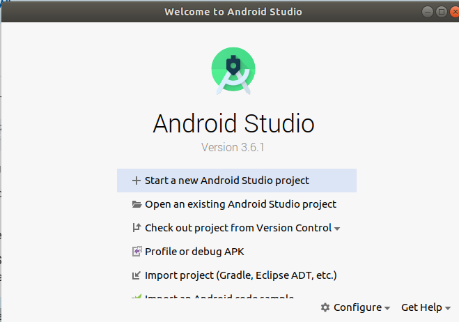

# Install Android Studio

1.  Proceed to https://developer.android.com/studio and download Android Studio.

2.  In a terminal window, change directories to wherever the installation .tar.gz file is located, in this example it is in the Downloads folder:

    ```
    $ cd Downloads
    ````

3.  If you are installing for just your profile follow step 3a. to unpack the tar.gz file.  If you are installing for shared users follow step 3b:

    3a. Single user install:

        ```
        $ tar xf android-studio-ide-192.6241897-linux.tar.gz
        $ sudo mv android-studio /usr/local/android-studio
        ```
    
    3b. Shared user install: 

        ```
        $ tar xf android-studio-ide-192.6241897-linux.tar.gz
        $ sudo mv android-studio /opt/android-studio
        ```

4.  Change directories to android-studio/bin/ directory, in this case it is a single user install: 

    ``` 
    $ cd /usr/local/android-studio/bin
    ```

5.  Execute the studio.sh file: 

    ```
    $ ./studio.sh
    ```

This will run Android Studio. It may take some time to load, depending on your system.

6.  When Android Studio loads, it may tell you that Android SDK is missing.


If so, keep clicking "Next" and then "Finish", and wait for "Downloading Components"


7.  Once loaded, you can choose a Config or installation folder (for advanced users) but for this tutorial we will select "Do not import settings" and click OK.


8.  Select to not data-share with Google for user experience improvements.

9.  The Android Studio Setup Wizard will appear, click "Next":


10.  On the following screen choose "Standard" and click "Next":


11.  Choose your preferred UI theme (Darcula or Light) and click "Next":

12.  The next screen allows you to review the installation settings, click "Next":


13.  `IF` you are notified that your system can run the Android emulator in _accelerated mode_, follow steps 14-20 to install KVM, otherwise skip to step 21.  (Installing KVM improves performance of any virtual device you are using for debugging.)


14.  When you are notified about downloading components, click "Finish":


15.  Check and install virtualization acceleration:

16. Open a new terminal window and install CPU checker:

        ```
        $ sudo apt install cpu-checker
        ```

17.  Verify that KVM acceleration can be used: 

        ```
        $ kvm-ok
        ```
18.  Will output:  

        ```
        INFO: /dev/kvm exists
        KVM acceleration can be used
        ```

19.  Use the following command to install KVM: 

        ```
        $ sudo apt-get install qemu-kvm libvirt-bin ubuntu-vm-builder bridge-utils
        ```

20.  Add the current user to the KVM group

        ```
        $ sudo adduser $USER kvm

21.  Restart your computer and proceed to reopen Android studio:

        ```
        $ cd /usr/local/android-studio/bin
        $ ./studio.sh
        ```

22.  The installation will be finished and the following screen will appear (Note: Go to "Configure" and select "Create Desktop Entry" to add an Icon to your list of applications).



[Home](../../README.md)
