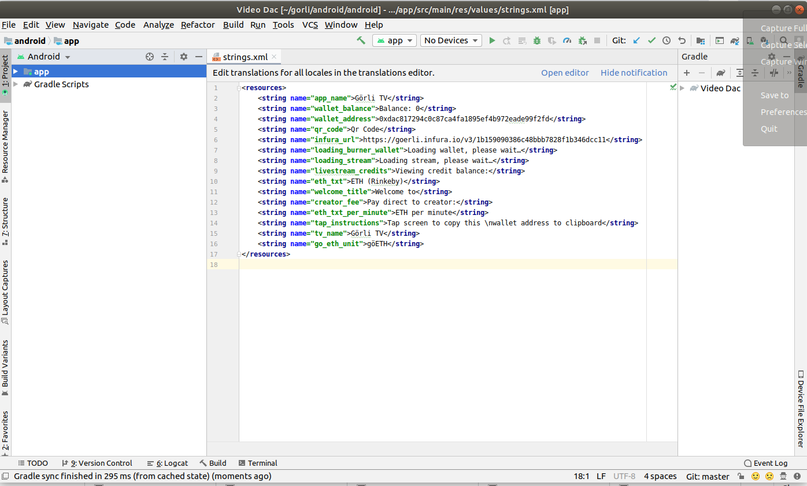

# Setting Key Variables

* App name (e.g. Acme TV)
* Pay-to address
* Network, from rinkeby, goerli, ropsten, kovan, mainnet, or a    custom RPC URL
* price-per-minute in network's native ETH
* `STREAM_URL` for the video content

You have imported the App and you are at the following screen where these variables can be set (`app/res/values/strings.xml`): 

You may wish to configure the following values in `strings.xml`:

* App name can be set in the "app_name" field.
* Pay-to address can be set in the "wallet_address" field.
* You must set the "infura_url" to choose a network, or this is where you would enter a custom RPC URL.

    * To get an infura_rul proceed to https://infura.io and create an account.
    * Create a new project. 
    * You can name the project, and then under keys select the endpoint to be the Ethereum network you wish to use.
    * Copy the link that is generated and paste it in the "infura_url" field of the configuration.

* Open `app/java/com.videodac.hls/helpers/Utils.kt`

* To set the streaming fee, recipient address and STREAM_URL, modify lines 21, 22 and 25 in `Utils.kt` and set the variables `streamingFeeInEth`, `recipientAddress` and `STREAM_URL`
    * There is a test stream of `hls` content running at http://52.29.226.43:8935/stream/hello_world.m3u8
    * To find out more about how to create your own `hls` URL, see [Infinite Digital Stage from videoDAC](https://github.com/videoDAC/infinite-digital-stage).

[Home](../../README.md)
